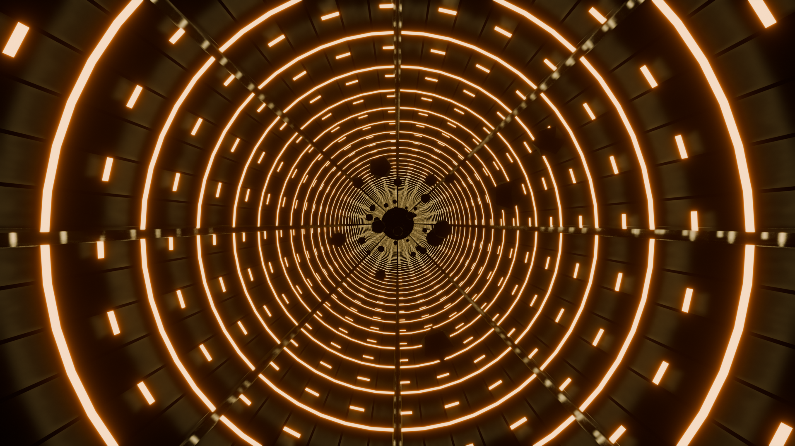
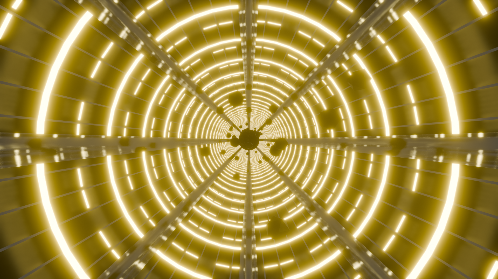
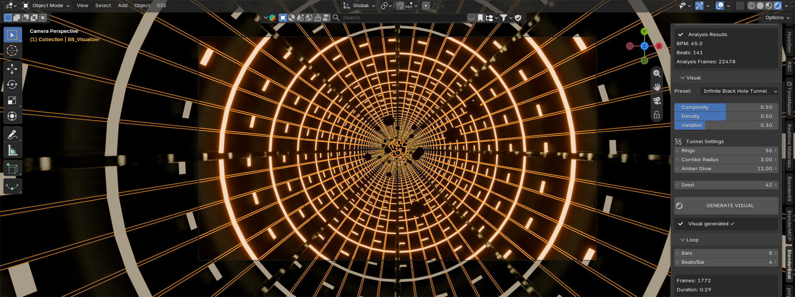
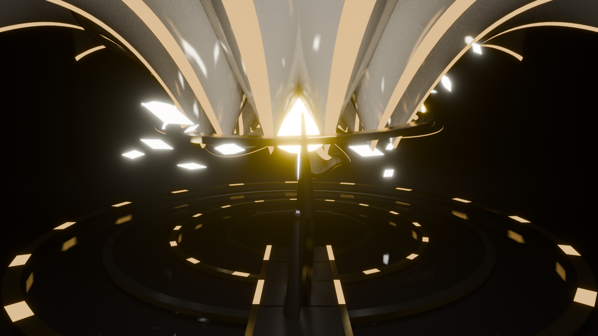

# 🎵 BlenderBeat

> **Music-Reactive Procedural 3D Visualizer & VJ Engine for Blender 5.x**

Transform any audio track into cinematic, music-reactive 3D visuals using procedural Geometry Nodes, dynamic EEVEE-Next shaders, and real-time viewport compositing.



---

## ✨ Features

- **⚡ Procedural & Modular Architecture**: Built entirely on Blender 5.x Geometry Nodes and shader networks.
- **🎧 Full-Spectrum Audio Reactivity**:
  - Automatic beat & transient detection (BPM, kicks, snares, energy levels).
  - Frequency band splitting (sub-bass, bass, mids, presence, brilliance).
  - Z-traveling shockwaves and audio-modulated wave functions.
- **🔥 Real-time Viewport Bloom**: Custom compositor fog-glow pipeline configured for Blender 5.2 EEVEE-Next (`ALWAYS` active in viewport).
- **🎛️ Presets Out of the Box**:
  - **Infinite Black Hole Tunnel**: High-speed sci-fi corridor with amber LED accents, chrome rails, floating debris, and audio-reactive shockwaves heading toward an event horizon.
  - **Cosmic Blossom**: Procedural sacred-geometry lotus with crystalline materials, particle halo systems, and audio-driven petal expansion.
- **🎥 Dynamic Camera**: Audio-reactive camera punch (+12mm focal punch on transients) and seamless looping.

---

## 📸 Screenshots

| Infinite Black Hole Tunnel | Blender Viewport UI & Control Panel |
| :---: | :---: |
|  |  |

| Cosmic Blossom Preset |
| :---: |
|  |

---

## 🚀 Installation

1. Download or clone this repository:
   ```bash
   git clone https://github.com/hfxstudios0001/blender-beat.git
   ```
2. In Blender (5.0 or later):
   - Navigate to **Edit** > **Preferences** > **Add-ons**.
   - Install or link the `blenderbeat` folder into your Blender addons directory.
3. Enable the **BlenderBeat** add-on in the preferences list.
4. Press `N` in the 3D Viewport to open the sidebar and select the **BlenderBeat** tab.

---

## 🛠️ Requirements

- **Blender 5.0+** (Tested on Blender 5.2 LTS with EEVEE-Next).
- Python 3.10+ (Bundled with Blender).
- Optional audio processing dependencies (Librosa / NumPy) can be installed via the add-on panel if required.

---

## 📂 Project Structure

```text
blenderbeat/
├── animation/     # F-Curve baking, smoothing, modulation & looping
├── audio/         # Beat detection, frequency analyzer & cache system
├── nodes/         # Programmatic Geometry Nodes & Shader node builders
├── presets/       # Modular visual presets (Black Hole Tunnel, Cosmic Blossom)
├── visual/        # Lighting, materials library, camera rigs & geometry
├── operators.py   # Blender operator definitions
├── panels.py      # N-Panel UI elements
└── properties.py  # Blender scene property groups
```

---

## 📄 License

This project is licensed under the GNU General Public License v3.0 (GPL-3.0) — see the [LICENSE](LICENSE) file for details.
